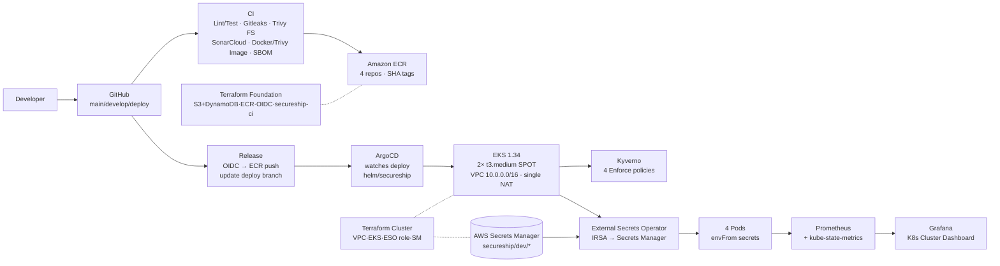

# SecureShip — End-to-End DevSecOps + GitOps Platform

> 4 microservices on EKS with zero-touch CI → ECR → GitOps → Kyverno → ESO → Observability. One `terraform apply` + `./scripts/bootstrap-cluster.sh` = full platform in ~15m, destroyed in ~5m for < $5 per run.


---

## Architecture



**Flow:** `push develop → PR → merge main → CI green → Release (build 4 images with SHA, push ECR, commit SHA to deploy) → ArgoCD auto-sync → Kyverno validates → ESO injects secrets → Pods Running → Prometheus scrapes → Grafana shows Nodes 2 / Pods 4`

---

## Tech Stack

| Layer             | Tool                                                                                                                                                                                                | Why                                    |
| ----------------- | --------------------------------------------------------------------------------------------------------------------------------------------------------------------------------------------------- | -------------------------------------- |
| **App**           | Node 22 · Express · TypeScript · Prisma · 4 services (api-gateway :8000, order :8001, tracking :8002, notify :8003)                                                                                 | Lightweight, fast cold start           |
| **CI**            | GitHub Actions · ESLint · Prettier · Jest 16/16 · Gitleaks · Trivy FS/Image · Syft SBOM · SonarCloud                                                                                                | Shift-left security                    |
| **CD**            | Release workflow (OIDC `id-token: write`, `configure-aws-credentials@v5`) · ECR `081382613682.dkr.ecr.ap-south-1.amazonaws.com` · `deploy` branch GitOps                                            | No static AWS keys, SHA-immutable tags |
| **Infra**         | Terraform · S3 `secureship-tf-state-…` + DynamoDB lock · VPC `6.7.0` · EKS `21.0.0` · K8s 1.34 · `t3.medium` SPOT single NAT                                                                        | < $5/day, ENI-safe (17 pods/node)      |
| **GitOps**        | Helm umbrella `helm/secureship` · ArgoCD `10.4.0` (helm `values.yaml` + `application.yaml` `CreateNamespace`)                                                                                       | Declarative, auto-sync                 |
| **Policy**        | Kyverno `3.9.0` Enforce: `disallow-latest-tag` · `disallow-privileged` · `require-labels` · `require-resource-limits` (excludes kube-system/kyverno/argocd/monitoring/external-secrets)             | Admission-time guardrails              |
| **Secrets**       | AWS Secrets Manager `secureship/dev/database` + `…/jwt` (dummy) · ESO `2.9.0` IRSA `secureship-eso` (dual OIDC trust `oidc-eks` + `oidc.eks`) · `ClusterSecretStore` + `ExternalSecret` → `envFrom` | No secrets in git, rotation-ready      |
| **Observability** | Prometheus `server + kube-state-metrics` (node-exporter disabled for ENI) · Grafana `admin/secureship-dev` (datasource pre-wired)                                                                   | Lightweight 2 pods                     |

---

## Repo Layout

```
services/                 # 4 Node/TS services (each Dockerfile: node:22-slim + openssl + prisma generate)
helm/secureship/          # Umbrella chart (namespace, serviceaccount, service, deployment with envFrom + scrape annotations)
environments/dev/values.yaml  # GitOps overrides (ArgoCD $values)
terraform/foundation/     # S3, DynamoDB, 4 ECR, OIDC provider, secureship-ci role
terraform/cluster/        # VPC, EKS, node group (desired 2), SM secrets, ESO IRSA role
argocd/                   # values.yaml (insecure, dex false) + application.yaml (deploy branch, $values)
kyverno/policies/         # 4 Enforce ClusterPolicies
monitoring/               # prometheus-values.yaml, grafana-values.yaml
scripts/bootstrap-cluster.sh  # One-command post-terraform bootstrap (idempotent helm upgrade --install)
```

## Branches

| Branch    | Purpose                                | Protection                           |
| --------- | -------------------------------------- | ------------------------------------ |
| `main`    | Protected, PR required, strict         | `required_approving_review_count: 0` |
| `develop` | Integration, CI on push                | —                                    |
| `deploy`  | GitOps target, Release writes SHA tags | ArgoCD watches                       |

---

## Quick Start

### Local (no AWS)

```bash
npm ci
docker compose up --build
# gateway :8000  orders :8001  tracking :8002  notify :8003
curl http://localhost:8000/health  # {"status":"ok","service":"api-gateway","version":"1.0.1"}
npm test -- --coverage  # 16/16
npx prettier --check .; npx eslint services --ext .ts
```

### AWS — Full Platform (~15m)

```bash
# 0. prereqs: aws cli + profile `cloudsentry` (Account 081382613682, ap-south-1) + SonarCloud org raxj06

# 1. Foundation (once, ~1m)
cd terraform/foundation && terraform init && terraform apply -auto-approve
# creates: S3 secureship-tf-state-…, DynamoDB lock, 4 ECR, OIDC, secureship-ci

# 2. Cluster (~12m)
cd ../cluster && terraform init && terraform apply -auto-approve
# creates: VPC, EKS 1.34, 2× t3.medium SPOT, SM secureship/dev/*, secureship-eso
# If IRSA InvalidIdentityToken: aws iam create-open-id-connect-provider --url https://oidc.eks.ap-south-1.amazonaws.com/id/<ID> --client-id-list sts.amazonaws.com --thumbprint-list 06b25927c42a721631c1efd9431e648fa62e1e39 --profile cloudsentry

# 3. Bootstrap in-cluster (~3m, idempotent)
cd ../.. && ./scripts/bootstrap-cluster.sh
# installs: ArgoCD → Application → ESO → Kyverno policies → Prometheus + kube-state-metrics → Grafana

# 4. Verify
kubectl get application -n argocd  # Synced Healthy 72b4921
kubectl get pods -n secureship-dev  # 4 Running (new SHA)
kubectl get externalsecrets -n secureship-dev  # SecretSynced True
kubectl get clusterpolicies  # 4 Ready
```

### Access (port-forward, no ingress — free)

```powershell
# ArgoCD
kubectl get secret argocd-initial-admin-secret -n argocd -o jsonpath="{.data.password}" | ForEach-Object { [System.Text.Encoding]::UTF8.GetString([System.Convert]::FromBase64String($_)) } # admin
kubectl port-forward svc/argocd-server -n argocd 8080:80
# → http://localhost:8080

# Grafana
kubectl port-forward svc/grafana -n monitoring 3000:80
# → http://localhost:3000  admin / secureship-dev → Dashboards → Kubernetes Cluster (Prometheus) → Pods Running 4 / Nodes 2
# Explore → Prometheus → up  or http_requests_total

# App (each in separate terminal)
kubectl port-forward svc/api-gateway -n secureship-dev 8000:8000
curl http://localhost:8000/health  # {"status":"ok","service":"api-gateway","version":"1.0.1"}
kubectl port-forward svc/order-service -n secureship-dev 8001:8001
kubectl port-forward svc/tracking-service -n secureship-dev 8002:8002
kubectl port-forward svc/notification-service -n secureship-dev 8003:8003

# Prometheus targets
kubectl port-forward svc/prometheus-server -n monitoring 9090:80
# → http://localhost:9090/targets  4/4 kubernetes-pods UP
```

### Trigger Full E2E Cycle

```bash
# Edit services/api-gateway/src/routes/health.ts → version: "1.0.2"
git checkout develop && git add . && git commit -m "feat: bump version" && git push origin develop
gh pr create --base main --head develop --title "feat: e2e" --body "triggers release" && gh pr merge --merge
# → CI green → Release green (4 images 3a1a77d → ECR, deploy 72b4921) → ArgoCD Synced → pods 3a1a77d → curl shows 1.0.2
```

### Destroy (save $)

```bash
cd terraform/cluster && terraform destroy -auto-approve
cd ../foundation && terraform destroy -auto-approve
# optional: aws s3 rb s3://secureship-tf-state-081382613682 --force; aws dynamodb delete-table --table-name secureship-tf-lock
# ECR images remain if you keep foundation; cost ~$0 if destroyed. Full run < $5.
```

---

## Verification Checklist (what we proved)

- [x] CI: `lint/typecheck/test 16/16` + `gitleaks` + `trivy fs` + `sonarcloud` + `docker build/trivy image/SBOM` all green
- [x] Release: OIDC `id-token: write` → 4 ECR images `3a1a77d` + `deploy` branch `72b4921` auto-updated
- [x] GitOps: ArgoCD `Synced Healthy` watches `deploy`, `helm/secureship` with `envFrom` secrets
- [x] Policy: Kyverno 4 Enforce blocks `nginx:latest` + `privileged:true`
- [x] Secrets: SM `secureship/dev/*` → ESO `SecretSynced True` → pods `env DATABASE_URL/JWT_SECRET`
- [x] Observability: Prometheus `4/4 kubernetes-pods UP` + `kube-state-metrics` → Grafana `Pods Running 4 / Nodes 2`
- [x] Port-forward: All 4 `/health` return `200 {status:ok,version:1.0.1}`

---

## Cost

| Item                 | $/mo if left running | $ per 1-day run |
| -------------------- | -------------------- | --------------- |
| EKS control plane    | $73                  | $2.4            |
| 2× t3.medium SPOT    | ~$30                 | $1              |
| NAT gateway (single) | ~$32                 | $1              |
| SM 2 secrets         | $0.80                | $0.03           |
| S3 + DynamoDB + ECR  | < $1                 | ~$0             |
| **Total**            | **~$136**            | **< $5**        |

Destroy after demo — `terraform destroy` is the portfolio flex: “cost-aware, not just cloud-native”.

---

## Known trade-offs (ponytail lite)

- **Light Prometheus:** `node-exporter` disabled to stay within ENI 17 pods/node → Grafana CPU/Memory/Disk `N/A` is expected; pod panels work. Enable `nodeExporter: true` in `monitoring/prometheus-values.yaml` if you want full dashboard (needs 2 more pods, still fits on 2 nodes).
- **Dual OIDC trust:** EKS 1.34 creates `oidc-eks.*.api.aws` provider but issuer is `oidc.eks.*.amazonaws.com` — role trusts both. Remove old when AWS migrates fully.
- **Prettier:** `helm/`, `kyverno/`, `monitoring/`, `terraform/` ignored via `.prettierignore` — helm templates contain Go templating that breaks `prettier --check`.

---

## Further Ideas (not needed for done)

- Ingress + ACM (ALB ~$15/mo) for public URL
- Full `kube-prometheus-stack` (15 pods) if you scale to 3 nodes
- Real DB (RDS) + ESO rotation, not dummy `changeme`
- OPA/Gatekeeper alternative to Kyverno for comparison

Full plan: [PLAN.md](PLAN.md) · Spec: [SecureShip_DevSecOps_GitOps_Project.md](SecureShip_DevSecOps_GitOps_Project.md)
